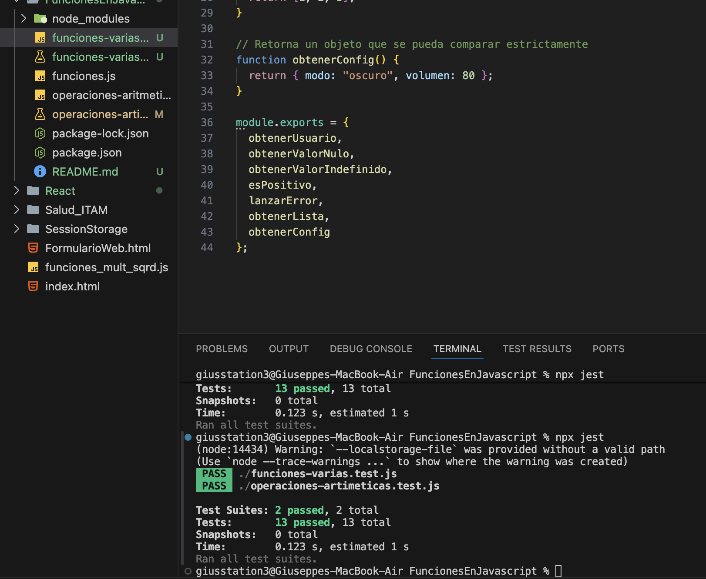

## Investigación sobre funciones en Jest

**.toEqual()**  
Compara el valor de dos variables verificando que tengan el mismo contenido, incluso en objetos y arreglos.  
Sirve cuando no importa que no sea exactamente la misma referencia, solo que los datos coincidan.

**.toBeTruthy()**  
Valida que el valor evaluado sea considerado verdadero en JavaScript.  
Es útil para confirmar que algo no es nulo, vacío, falso o cero, sino que se interpreta como verdadero.

**.toBeFalsy()**  
Confirma que el valor se interprete como falso en JavaScript.  
Detecta valores como false, 0, "", null, undefined o NaN.

**.toBeNull()**  
Verifica que el valor sea exactamente null.  
Se usa cuando queremos asegurar que una función o resultado no tenga un valor definido.

**.toBeUndefined()**  
Comprueba que el valor sea undefined.  
Se usa cuando una variable no está definida o una función no retorna nada explícitamente.

**.toThrow()**  
Evalúa si una función lanza un error al ejecutarse.  
Permite probar casos donde el código debería fallar, por ejemplo divisiones entre cero o validaciones incorrectas.

**.toStrictEqual()**  
Compara valores asegurando que coincidan en contenido, tipo de datos y estructura exacta.  
Es más estricto que .toEqual() porque detecta diferencias como propiedades faltantes o tipos distintos.

